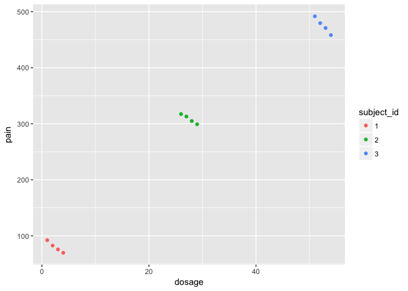
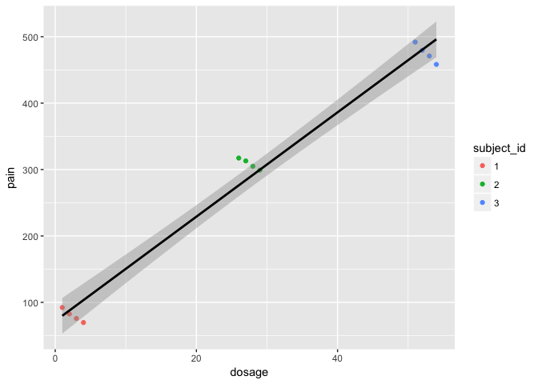
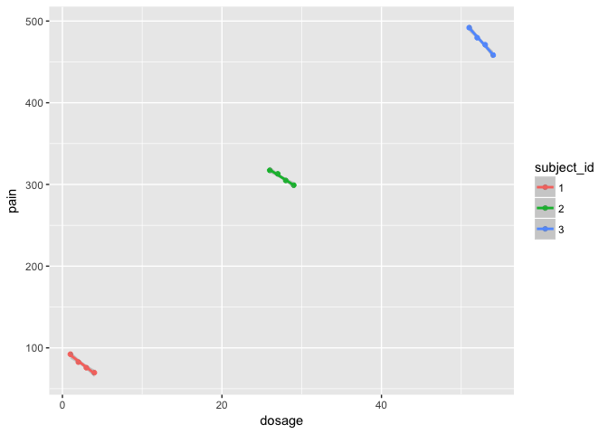

Regression on Repeated Measurements
================
Yu-Zhen Tu<br>
2018/2/26

Introduction
------------

Regression analyses on repeated measurements are performed frequently. For instance, we may want to know the relationship between painkiller dosage and felt pain degree, while each participant in the study have multiple trials and their behaviors were recorded.

Note that this study question is *not* asking the relationship between sum of the dosage and average of felt pain - that will be a different analysis. By the way, point estimation of data always loses information, but that's not our topic today.

Material & Method
-----------------

Assume that we have three participants included. Each of them took the medicine four times and the felt pain degrees were written. (The numbers below would not make medical sense but please recognize the idea.)

``` r
set.seed(1337)

x1 <- 1:4
y1 <- 100 + (rnorm(4) - 8 * x1)
x2 <- 26:29
y2 <- 500 + (rnorm(4) - 7 * x2)
x3 <- 51:54
y3 <- 1000 + (rnorm(4) - 10 * x3)

df_test <- data.frame(subject_id = factor(rep(c(1,2,3), each = 4)),
                      dosage = c(x1, x2, x3),
                      pain = round(c(y1, y2, y3), 1))
df_test
```

    ##    subject_id dosage  pain
    ## 1           1      1  92.2
    ## 2           1      2  82.6
    ## 3           1      3  75.7
    ## 4           1      4  69.6
    ## 5           2     26 317.3
    ## 6           2     27 313.0
    ## 7           2     28 304.9
    ## 8           2     29 299.1
    ## 9           3     51 491.9
    ## 10          3     52 479.6
    ## 11          3     53 471.0
    ## 12          3     54 458.3

In the following paragraphs, I will build two models based on the pseudo-data. One is simple linear regression model, and the other is mixed-effects model. I will use `lm` and `lmer` function in R respectively.

Analysis results & Discussion
-----------------------------

``` r
# Loading packages
library(ggplot2)
library(lme4)
```

### Visualization of data

``` r
g <- ggplot(df_test, aes(dosage, pain)) + geom_point(aes(color = subject_id))
g
```



### Simple linear regression

``` r
summary(lm(pain ~ dosage, data = df_test))
```

    ## 
    ## Call:
    ## lm(formula = pain ~ dosage, data = df_test)
    ## 
    ## Residuals:
    ##     Min      1Q  Median      3Q     Max 
    ## -37.798 -17.877  -0.702  14.621  41.150 
    ## 
    ## Coefficients:
    ##             Estimate Std. Error t value Pr(>|t|)    
    ## (Intercept)  71.9138    12.3506   5.823 0.000168 ***
    ## dosage        7.8553     0.3604  21.794 9.25e-10 ***
    ## ---
    ## Signif. codes:  0 '***' 0.001 '**' 0.01 '*' 0.05 '.' 0.1 ' ' 1
    ## 
    ## Residual standard error: 25.52 on 10 degrees of freedom
    ## Multiple R-squared:  0.9794, Adjusted R-squared:  0.9773 
    ## F-statistic:   475 on 1 and 10 DF,  p-value: 9.253e-10

``` r
g + geom_smooth(method = "lm", color = "black")
```



Here we see the dosage is positively related to felt pain. Whenever the dosage increases by one unit, the felt pain increases by about seven units, and this effect is significant (P &lt; 0.001). The adjusted R-squared is 0.9773, which is rather high.

At this point we could probably say that "The more painkiller one takes, the more pain he or she would feel." However, if I draw respective regression line of each participant, the story will be very different:

``` r
g + geom_smooth(aes(color = subject_id), method = "lm")
```



We see that the relationships between dosage and felt pain in respective participant are all negatively correlated, but simple linear regression failed to show that. That is because simple linear regression neglects the dependence between data points within the same participant. Instead, it treats all 12 data points as if they were collected from 12 different people.

Quoted from the paper "Linear regression analysis with repeated measurements" in 1984 of Allan Donner:

> Since measurements taken on a single subject tend to be more alike than those taken on different subjects, this will be the case in repeated measures regression unless the within-subject clustering is entirely explained by differences in X... depending also on how the values of the independent variable are selected, a statistically nonsignificant relationship between Y and X may be incorrectly reported as significant, and confidence intervals involving beta\_0 and beta\_1, may be misleadingly short.

To address this problem, let's instead try mixed-effects model, where "subject" will also be considered as one feature of random effect.

### Mixed-effects model

We see from the figure above that the average baselines of subjects are very different. Hence I group the data points by subjects and allow the subjects have their own intercepts of pain vs. dosage:

``` r
summary(lmer(pain ~ dosage + (1 | subject_id), data = df_test))
```

    ## Linear mixed model fit by REML ['lmerMod']
    ## Formula: pain ~ dosage + (1 | subject_id)
    ##    Data: df_test
    ## 
    ## REML criterion at convergence: 77.4
    ## 
    ## Scaled residuals: 
    ##      Min       1Q   Median       3Q      Max 
    ## -1.60297 -0.19477  0.04491  0.25937  1.53768 
    ## 
    ## Random effects:
    ##  Groups     Name        Variance  Std.Dev.
    ##  subject_id (Intercept) 161876.29 402.339 
    ##  Residual                    8.45   2.907 
    ## Number of obs: 12, groups:  subject_id, 3
    ## 
    ## Fixed effects:
    ##             Estimate Std. Error t value
    ## (Intercept) 512.2454   233.2030   2.197
    ## dosage       -8.1568     0.7489 -10.891
    ## 
    ## Correlation of Fixed Effects:
    ##        (Intr)
    ## dosage -0.088

Now we see the fixed effect of dosage is -8.1568, which means that we expect about eight-units decrease of pain when the dosage is increased by one unit.

Conclusion
----------

The simple linear regression model, unlike mixed-effects model, regards all data points as being independent and seeks ordinary least squares without considering individual contributions to the global trend, which can generate misleading inference. Hence, when performing data analyses related to repeated measurements, make sure this issue is factored.

References
----------

-   [Baayen, R. H., Davidson, D. J., & Bates, D. M. (2008). Mixed-effects modeling with crossed random effects for subjects and items. *Journal of Memory and Language*, 59(4), 390-412.](https://www.sciencedirect.com/science/article/pii/S0749596X07001398)
-   [Bates, D., Mächler, M., Bolker, B., & Walker, S. (2015). Fitting Linear Mixed-Effects Models Using lme4. *Journal of Statistical Software*, 67(1), 1-48.](https://www.jstatsoft.org/article/view/v067i01/0)
-   [Donner, A. (1984). Linear regression analysis with repeated measurements. *Journal of Chronic Diseases*, 37(6), 441-448.](http://www.jclinepi.com/article/0021-9681(84)90027-4/abstract)
-   [Obtaining a nonsence estimate of fixed slope after including random slope into the model](https://stats.stackexchange.com/q/330463/150140) on Cross Validated

Extended Readings
-----------------

-   [Predictive Modeling - Should we care about mixed modeling?](https://stats.stackexchange.com/questions/22407/predictive-modeling-should-we-care-about-mixed-modeling)